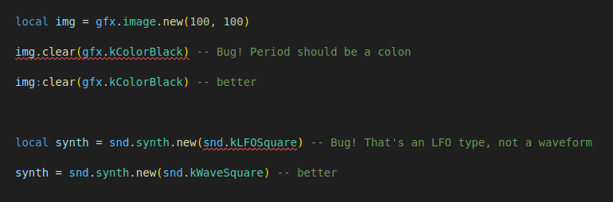
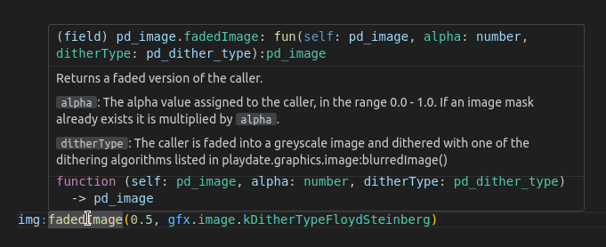

## Type annotations for the Playdate SDK

**SDK Version:** 3.0.1

The file `__types.lua` contains [annotations](https://luals.github.io/wiki/annotations/)
for the [Playdate](https://play.date/) handheld console's [Lua SDK](https://play.date/dev/).

This includes:

- parameter and return types for (basically) all SDK functions, used for both **autocomplete** and **type checking**
- **documentation** for all those functions that your IDE can show on hover

For example, if you have the following code:

```lua
local img = gfx.image.new(100, 100)

img.clear(gfx.kColorBlack) -- Bug! Period should be a colon
img:clear(gfx.kColorBlack) -- better

local synth = snd.synth.new(snd.kLFOSquare) -- Bug! That's an LFO type, not a waveform
synth = snd.synth.new(snd.kWaveSquare) -- better
```

your IDE will highlight the bugs as errors (if you configure it that way):



Documentation for all those functions is also available on hover, so you don't always have to go
back and forth between your IDE and the [SDK documentation](https://sdk.play.date/):



## Requirements

For this to work, your IDE needs to be able to handle [Lua annotations](https://luals.github.io/wiki/annotations/).

If you're using Visual Studio Code or any other IDE with the [Lua Language Server](https://luals.github.io/) extension, you're all set!

## Usage

[Download the file `__types.lua`](https://raw.githubusercontent.com/balpha/playdate-types/main/__types.lua) and place it into
the `CoreLibs` directory of your Playdate SDK. That's the same folder where `__stub.lua` resides, which is the SDK-provided
file for minimal autocomplete support.

I do in fact recommend deleting `__stub.lua` once you've placed `__types.lua` here.

Assuming the SDK was already working correctly in your IDE, then the language server (and thus your IDE) should pick this up immediately.
If it doesn't, restarting your IDE should do the trick.

You can modify the language settings (in VS Code that would be in `.vscode/settings.json` in your project) to get the level of
type strictness that you want. See the [Diagnostics documentation](https://luals.github.io/wiki/diagnostics/) for details.

## License

The file `__types.lua` ("the File") was generated by Benjamin Dumke-von der Ehe ("the Author") based on the
[SDK documentation](https://sdk.play.date/), which is published by Panic Inc. under the
[Playdate SDK License](https://play.date/dev/sdk-license/). Panic is not involved in the creation of the
File and does not take any responsibility for its completeness or correctness. But Panic
[has given permission](https://devforum.play.date/t/need-panics-permission-to-share-a-lua-type-annotation-file-for-the-sdk/12165/28)
for this file to be published by the Author, and for the File to be used by anyone, as long as it's used under
the same conditions as the Playdate SDK itself, as laid out in the Playdate SDK License.
